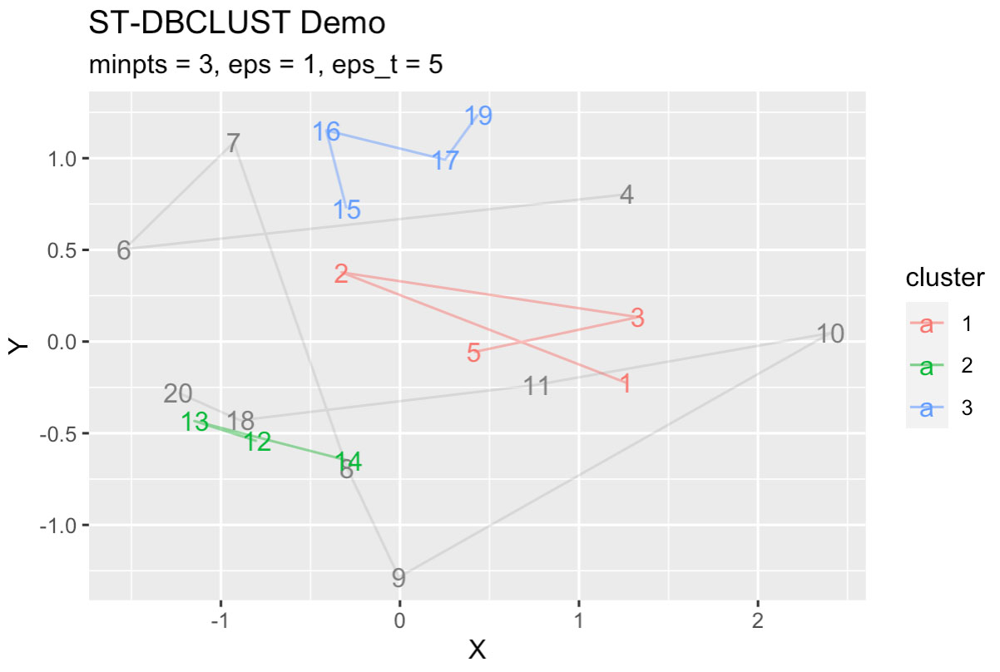

# stdbscanr

<!-- badges: start -->
<!-- badges: end -->

The goal of stdbscanr is to find clusters in trajectory data in x, y, and t, using the ST-DBSCAN clustering algorithm, such that
1. Points are directly connected to other points within `eps` distance in the x,y plane and within `eps_t` in the t axis
2. Points are not connnected through points which have less than minpts connections themselves (these are terminating points)
3. To do so in a way that is efficient in terms of memory and time.

The algorithm follows the paper below:

[Derya Birant & Alp Kut, **ST-DBSCAN: An algorithm for clustering spatial–temporal data**, *Data & Knowledge Engineering*, Volume 60, Issue 1, 2007, Pages 208-221, ](https://doi.org/10.1016/j.datak.2006.01.013).

Previous implementations of the ST-DBSCAN clustering algorithm compute the entire distance matrix before taking points within the given radius, which makes them scale as O(n^2)​ in both memory and time, becoming prohibitive for large data sets.

This implementation leverages sorted time data and only computes spatial distances for points which have not already been excluded by being too far apart in time, drasticallly speeding up compute time and lowering memory consumption, so it now scales as O(n * `eps_t`) and as `eps_t` is typically small, it practically scales as O(n), linear in the input data.


## Installation

You can install the released version of stdbscanr from my github repo with:

``` r
install.packages("devtools")
devtools::install_github("gdmcdonald/stdbscanr")
```

## Example

This is a basic example which shows you how to use stdbscanr to cluster your space-time data:

``` r
library(stdbscanr)
set.seed(0) # set random seed to get repeatable results

# make some trajectory data
dt <- data.table(X = rnorm(20),
                 Y = rnorm(20),
                 timestamp = 1:20)

# find clusters and density in it
out <- get_clusters_from_data(dt
                              ,x = "X"
                              ,y = "Y"
                              ,t = "timestamp"
                              ,eps = 1 # 1 metre distance threshold from other point
                              ,eps_t = 5 # 5 second time threshold from other point
                              ,minpts = 3)[  # minimum connected to 3 points to continue growing a cluster
                                ,cluster:=factor(cluster)] # make clusters a factor 

#plot clusters output
ggplot(out, 
       aes(x = X, 
           y = Y, 
           label = timestamp, 
           color = cluster))+
  geom_path(data = out[!is.na(cluster),],
            alpha = 0.5)+
  geom_path(data = out[is.na(cluster),],
            alpha = 0.2)+
  geom_text()+
  labs(title = "ST-DBCLUST Demo",
       subtitle = "minpts = 3, eps = 1, eps_t = 5")
```



